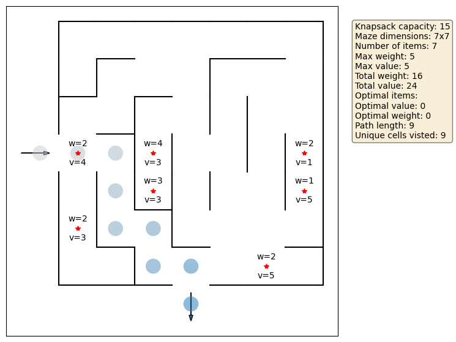
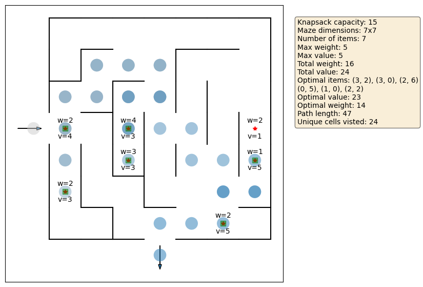

[](https://classroom.github.com/a/Kf5p43g2)
# Overview

This is the skeleton code for Algorithms and Analysis COSC2123/3119 - *Dynamic Programming in Action: The Knapsack-Maze Challenge*. Across multiple tasks in this assignment, you will design and implement algorithms that navigate a maze to collect treasures. You will address both fully observable settings (where treasure
locations are known) and partially observable ones (where treasure locations aren’t unknown),
which requires strategic exploration and value estimation when solving the maze.

[Additional information, as well as the specification, can be found here.](https://rmit.instructure.com/courses/141229/assignments/1076865)

## Technical Specification

The main script is *mazeRunner.py*. It is in the same folder as this README, and is run with the command:

```python mazeRunner.py <config_file>```

In order to run the code, you must have a configuration file. The configuration file contains all the parameters that are needed to:
- generate a maze;
- place objects in the maze;
- create a knapsack;
- find the optimal items;
- generate a path through the maze; and
- create a visual output.

An example configuration file is given to you (*sampleConfig.json*). Feel free to make your own configuration files in order to experiment with different mazes, items and knapsacks. Configuration files take the form of:
```
{
    "randSeed": 50, <- seeds the run to produce the same conditions with the same parameters (remove if randomness wanted)
    "rowNum": 10, <- number of rows the maze has
    "colNum": 10, <- number of columns the maze has
    "randomWallRemovalPercent": 15, <- number between 0 and 80 of percentage of walls to remove
    "numItems": 7, <- number of items to be placed in the maze
    "maxWeight": 5, <- maximum weight an item can take
    "maxValue": 5, <- maximum value an item can take
    "knapsackCapacity": 15, <- the maximum weight the knapsack can hold
    "knapsackSolver": "recur", <- the method we are using to find the optimal items for the knapsack
    "entrances": [[3,-1]], <- entrance locations
    "exits": [[-1,3]], <- exit locations
    "pathFinder": "TaskC", <- method we are using to generate a path
    "solverEntranceIndex": 0, <- the index of the entrance we are using
    "visualise": true, <- flag to produce a visualisation (set to false when doing lots of runs)
    "mazeFromFile": false, <- flag for producing a fixed maze from a text file
    "mazeFileName": "sampleMaze01.txt", <- name of the text file we may be using (useless if flag above is false)
    "fileOutput": "sampleConfig" <- name that we save the outputs to
}
```

Because the knapsack solver's are not implemented (see Tasks A and B), your initial visualisation will only create the shortest path from entrance to exit:



After implementation, the optimal items will be highlighted in green, saved in the parameters, and the optimal path will take The Adventurer through these cells:



In order to create your own visualisations, you will need to install matplotlib.

## Testing

For your convenience, we have included a very basic test file. It can be run by entering the testing folder and running:

```python student_tester.py```

The output will tell you if you pass and fail some basic test for Tasks A and B.

**PLEASE NOTE: Passing these tests does NOT mean you will get full marks for Tasks A and B. These are very simple tests to make sure you are on the right track. The automated testing suite is significantly more rigourous.**

## Software Engineering Practices

Part of your mark is formed by following good SE practices. For details on this, please see the FAQ on EdStem.
